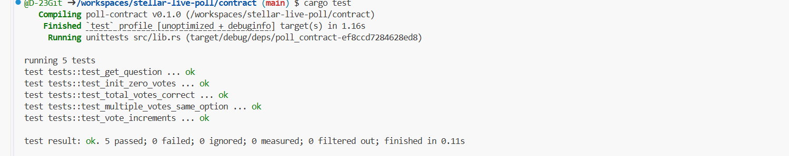

# 🗳️ Stellar Live Poll

> Real-time on-chain voting DApp built on Stellar Soroban Smart Contracts

---

## 🌐 Live Demo
👉 **[https://stellar-live-poll-dapp-phi.vercel.app/](https://stellar-live-poll-dapp-phi.vercel.app/)**

---

## 🎬 Demo Video (1 minute)
👉 **[https://www.loom.com/share/deab34a452cb4e119da6b7f7155b82db](https://www.loom.com/share/deab34a452cb4e119da6b7f7155b82db)**

---

## 📸 Test Output - 5 Tests Passing



```
running 5 tests
test tests::test_get_question ... ok
test tests::test_init_zero_votes ... ok
test tests::test_total_votes_correct ... ok
test tests::test_multiple_votes_same_option ... ok
test tests::test_vote_increments ... ok

test result: ok. 5 passed; 0 failed; 0 ignored; 0 measured; 0 filtered out; finished in 0.11s
```

---

## ✅ Orange Belt - Level 3 Requirements

| Requirement | Status |
|---|---|
| Mini-dApp fully functional | ✅ Done |
| Minimum 3 tests passing | ✅ Done - 5 tests passing |
| README complete | ✅ Done |
| Demo video recorded (1 minute) | ✅ Done |
| Minimum 3+ meaningful commits | ✅ Done - 10+ commits |
| Public GitHub repository | ✅ Done |
| Live demo link (Vercel) | ✅ Done |
| Test screenshot in README | ✅ Done |

---

## ✅ Yellow Belt - Level 2 Requirements

| Requirement | Status |
|---|---|
| Soroban contract deployed on testnet | ✅ Done |
| Frontend calls contract | ✅ Done |
| 3+ error types handled | ✅ Done |
| Transaction status visible | ✅ Done |
| Multi-wallet support | ✅ Done |
| Real-time synchronization | ✅ Done |
| StellarWalletsKit integration | ✅ Done |
| 2+ meaningful commits | ✅ Done |

---

## 🌟 Overview

**Stellar Live Poll** is a decentralized voting DApp built on Stellar blockchain using Soroban smart contracts. Users connect their Stellar wallet and vote for their preferred blockchain for payments. All votes are stored on-chain with real-time updates, donut chart, confetti animation, and transaction history.

---

## 🖼️ Screenshots

### 💳 Wallet Selection (Multi-wallet)


### ⏳ Transaction Processing


### ✅ Transaction Success + Voting UI


### 🔍 Transaction hash of a contract call (verifiable on Stellar Explorer)
[View Transaction on Stellar Explorer](https://stellar.expert/explorer/testnet/tx/61cf6539b19e3d7a3cf9d92873bea7a4a9828e27dab2ea798522af4e6925c370)


---

## ✨ Level 3 New Features

- 🍩 Donut chart showing live vote distribution
- 🔢 Animated vote counter
- 🎉 Confetti animation on vote success
- ⏱️ Countdown timer for auto-refresh (10s)
- 📋 Copy TX hash button
- 📤 Share results button
- 🌐 Network status indicator (Online/Offline)
- 🏆 Live rank system (#1 #2 #3 #4)
- ✅ Your Vote badge highlight
- ⏳ Loading spinner on vote button
- 📜 Transaction history with explorer links

---

## 📋 Contract Details

**Network:** Stellar Testnet

**Contract Address:**
```
CABXIUP6FTYYHZKD7ZCASSMFKKUSXYNCPVKRBNCIXPUEPQ5C3ZWGZYTV
```

**View on Stellar Expert:**
https://stellar.expert/explorer/testnet/contract/CABXIUP6FTYYHZKD7ZCASSMFKKUSXYNCPVKRBNCIXPUEPQ5C3ZWGZYTV

**Example Transaction:**
```
61cf6539b19e3d7a3cf9d92873bea7a4a9828e27dab2ea798522af4e6925c370
```

---

## 🧪 Smart Contract Tests

```bash
cd contract
cargo test
```

| Test | Description |
|---|---|
| test_init_zero_votes | Verifies initialization sets all votes to 0 |
| test_vote_increments | Confirms vote count increases correctly |
| test_total_votes_correct | Validates total vote aggregation |
| test_multiple_votes_same_option | Tests repeated voting on same option |
| test_get_question | Verifies question storage and retrieval |

---

## 🔐 Multi-Wallet Support
- Freighter
- xBull
- Lobstr
- Rabet

## 🛡️ Error Handling
- Wallet not connected
- Transaction rejected by user
- Insufficient XLM balance
- Wrong network (not Testnet)

## ⚡ Real-time Sync
- Votes auto-refresh every 10 seconds
- Live countdown timer
- On-chain state via Soroban RPC

## 📊 Transaction Status
- Pending / Confirmed / Failed

---

## 🛠️ Tech Stack

| Layer | Technology |
|---|---|
| Smart Contract | Rust + Soroban SDK |
| Frontend | React + Vite |
| Wallets | Freighter, xBull, Lobstr, Rabet |
| Network | Stellar Testnet |
| RPC | soroban-testnet.stellar.org |
| Deployment | Vercel |

---

## 🚀 Quick Start

```bash
git clone https://github.com/D-23Git/stellar-live-poll.git
cd stellar-live-poll
npm install
npm run dev
```

Open http://localhost:5173

**Requirements:**
- Node.js 18+
- Freighter Wallet browser extension
- Freighter set to Testnet
- Free test XLM from https://friendbot.stellar.org

---

## 📁 Project Structure

```
stellar-live-poll/
├── contract/
│   ├── src/lib.rs        (Soroban smart contract + 5 tests)
│   └── Cargo.toml
├── src/
│   ├── blockchain/
│   │   ├── contract.js
│   │   └── wallet.js
│   ├── components/
│   │   ├── PollSection.jsx
│   │   └── WalletSection.jsx
│   ├── App.jsx
│   ├── App.css
│   └── main.jsx
├── public/
└── README.md
```

---

## 📜 Smart Contract Functions

```rust
pub fn vote(env: Env, voter: Address, option: u32) -> u32 {
    voter.require_auth();
    assert!(option <= 3, "Invalid option");
    let mut count: u32 = env.storage().instance()
        .get(&DataKey::Votes(option)).unwrap_or(0);
    count += 1;
    env.storage().instance().set(&DataKey::Votes(option), &count);
    env.events().publish((symbol_short!("voted"), option), count);
    count
}

pub fn get_votes(env: Env, option: u32) -> u32 {
    env.storage().instance().get(&DataKey::Votes(option)).unwrap_or(0)
}

pub fn total_votes(env: Env) -> u32 {
    env.storage().instance().get(&DataKey::Total).unwrap_or(0)
}

pub fn get_question(env: Env) -> String {
    env.storage().instance().get(&DataKey::Question).unwrap()
}
```

---

## 🔗 Resources

- https://developers.stellar.org
- https://soroban.stellar.org
- https://freighter.app
- https://stellarwallets.org

---

🌟 Built with love on Stellar
 🏆 Level 2 + Level 3 Submission
