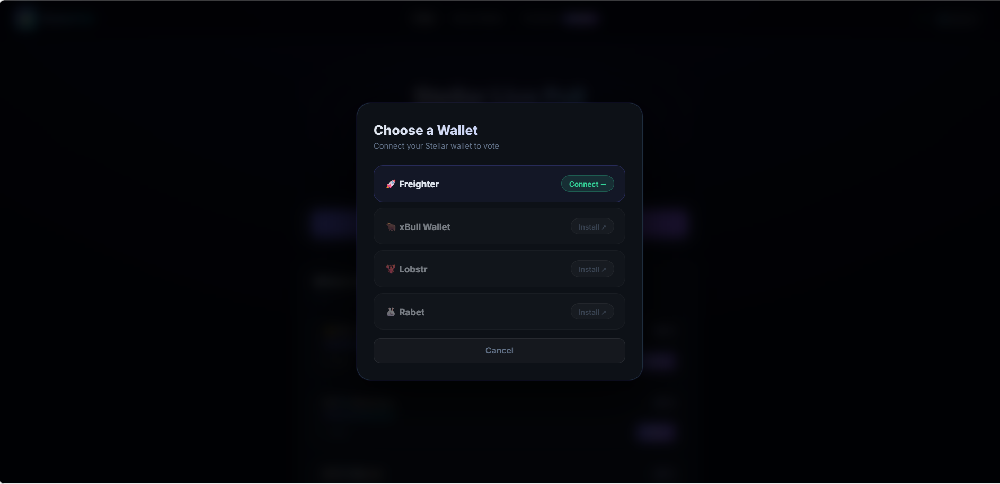
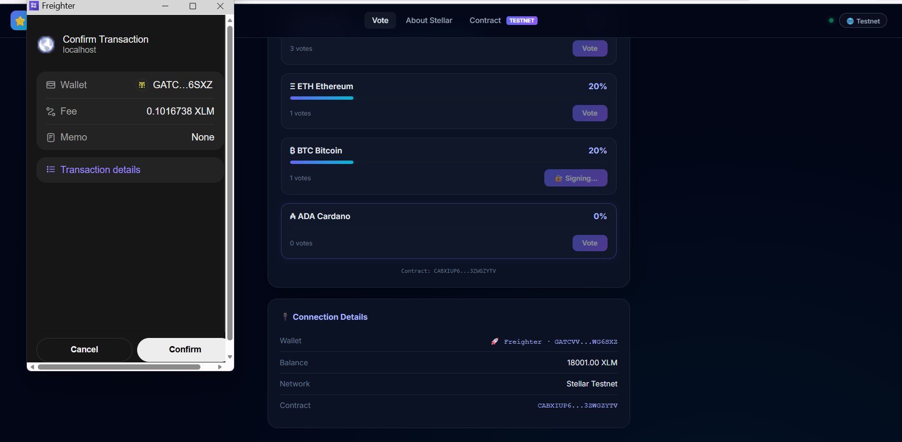
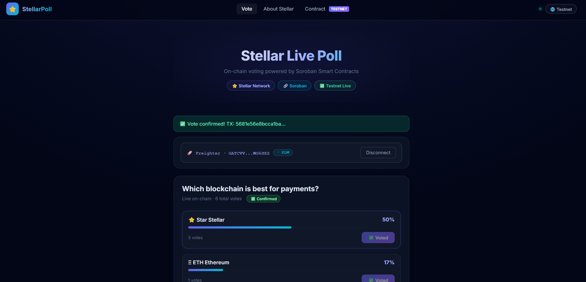
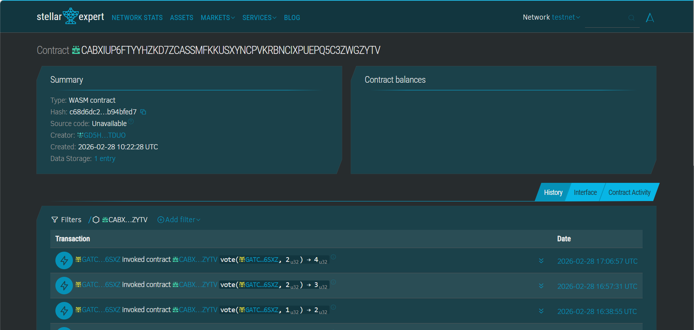

# 🗳️ Stellar Live Poll

> Real-time on-chain voting DApp built on Stellar Soroban

---

## 🌟 Overview

**Stellar Live Poll** is a decentralized voting DApp built on the Stellar blockchain using Soroban smart contracts.  
Users connect their Stellar wallet and vote for their preferred blockchain for payments.  
All votes are stored **on-chain** with **real-time updates** and transaction status tracking.

---

## 🌐 Live Demo

👉 https://stellar-live-poll-dapp-phi.vercel.app/

*(Frontend deployed on Vercel connected to Stellar Testnet contract)*

---

## 🖼️ Screenshots

### Wallet Selection (Multi-wallet)



### Transaction Processing



### Transaction Success + Voting UI



###Transaction hash of a contract call (verifiable on Stellar Explorer)



---

## 🥋 Yellow Belt – Level 2 Requirements

| Requirement                          | Status |
|-------------------------------------|--------|
| Soroban contract deployed on testnet | ✅ |
| Frontend calls contract              | ✅ |
| 3+ error types handled               | ✅ |
| Transaction status visible           | ✅ |
| Multi-wallet support                 | ✅ |
| Real-time synchronization            | ✅ |
| StellarWalletsKit integration        | ✅ |
| 2+ meaningful commits                | ✅ |

---

## 📋 Contract Details

**Contract Address**

```
CABXIUP6FTYYHZKD7ZCASSMFKKUSXYNCPVKRBNCIXPUEPQ5C3ZWGZYTV
```

**View on Stellar Expert**  
https://stellar.expert/explorer/testnet/contract/CABXIUP6FTYYHZKD7ZCASSMFKKUSXYNCPVKRBNCIXPUEPQ5C3ZWGZYTV

**Example Transaction Hash**

```
61cf6539b19e3d7a3cf9d92873bea7a4a9828e27dab2ea798522af4e6925c370
```

---

## 🚀 Quick Start (Local Setup)

### Prerequisites

- Node.js 18+
- Freighter Wallet browser extension
- Freighter set to **Testnet**
- Free test XLM from https://friendbot.stellar.org

### Installation

```bash
git clone https://github.com/D-23Git/stellar-live-poll.git
cd stellar-live-poll
npm install
npm run dev
```

Open http://localhost:5173

---

## ✨ Features

### 🔐 Multi-Wallet Integration

- Freighter
- xBull
- Lobstr
- Rabet

### 🛡️ Error Handling

- Wallet not installed
- Transaction rejected
- Insufficient balance

### ⚡ Real-time Sync

- Votes auto-refresh every 10s
- On-chain state updates
- Soroban RPC reads

### 📊 Transaction Status

- Pending
- Confirmed
- Failed

---

## 🛠️ Tech Stack

| Layer | Technology |
|------|-----------|
| Smart Contract | Rust + Soroban SDK |
| Frontend | React + Vite |
| Wallets | StellarWalletsKit |
| Network | Stellar Testnet |
| RPC | soroban-testnet.stellar.org |

---

## 📁 Project Structure

```
stellar-live-poll/
├── contract/
│   ├── src/lib.rs
│   └── Cargo.toml
├── src/
│   ├── blockchain/
│   ├── components/
│   ├── App.jsx
│   └── main.jsx
├── screenshots/
├── public/
└── README.md
```

---

## 📜 Smart Contract (Soroban)

```rust
pub fn vote(env: Env, voter: Address, option: u32) -> u32 {
    voter.require_auth();
    assert!(option <= 3, "Invalid option");

    let mut count: u32 = env.storage().instance()
        .get(&DataKey::Votes(option)).unwrap_or(0);

    count += 1;
    env.storage().instance().set(&DataKey::Votes(option), &count);

    env.events().publish((symbol_short!("voted"), option), count);
    count
}

pub fn get_votes(env: Env, option: u32) -> u32 {
    env.storage().instance()
        .get(&DataKey::Votes(option)).unwrap_or(0)
}
```

---

## 🔗 Resources

- https://developers.stellar.org
- https://soroban.stellar.org
- https://freighter.app
- https://stellarwallets.org

---

🌟 Built with ❤️ on Stellar  
🥋 Yellow Belt Level 2 Submission
