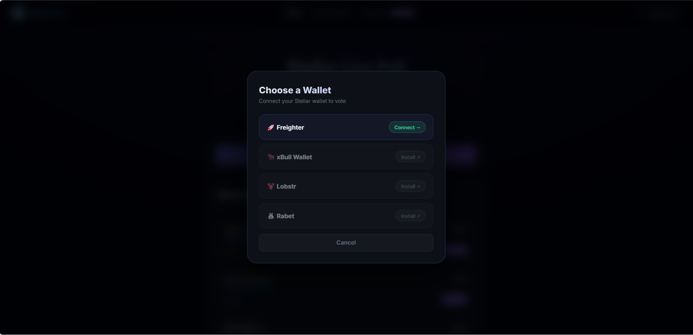
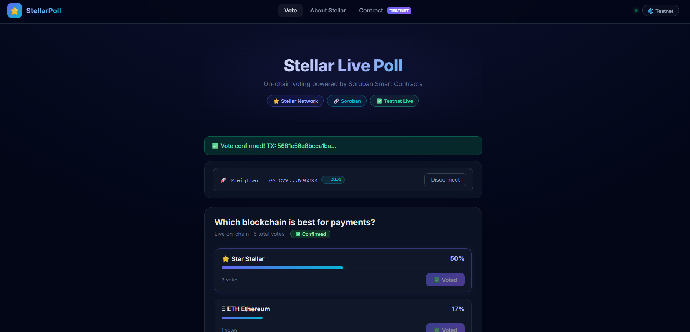
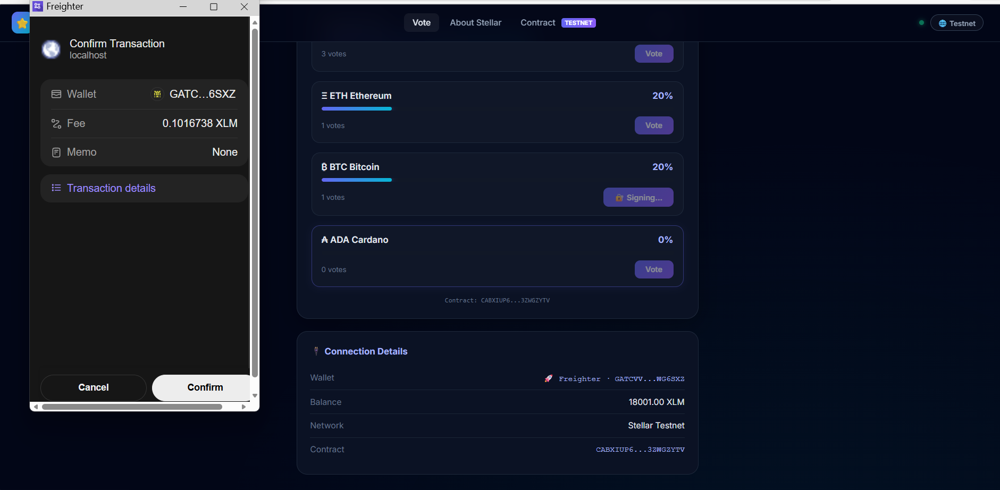
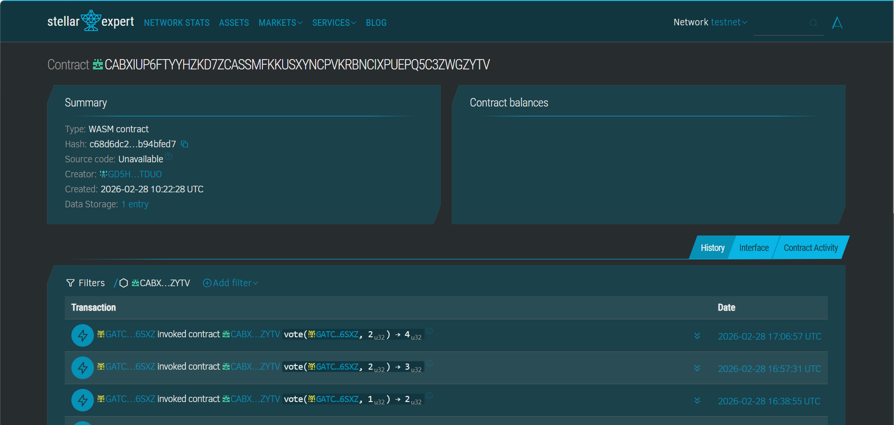
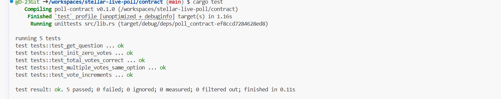
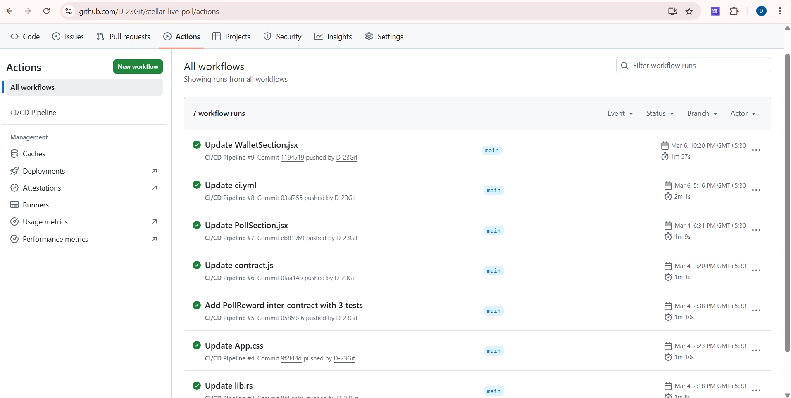
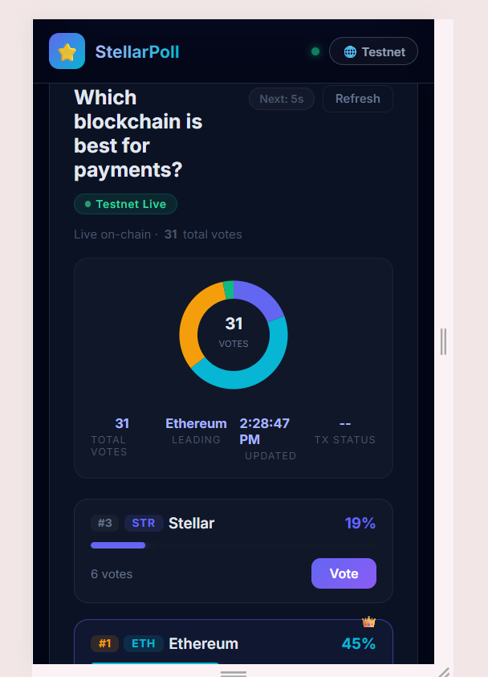

# 🗳️ Stellar Live Poll

> Real-time on-chain voting DApp built on Stellar Soroban Smart Contracts

---

## 🌐 Live Demo
👉 **[https://stellar-live-poll-dapp-phi.vercel.app/](https://stellar-live-poll-dapp-phi.vercel.app/)**

---

## 🎬 Demo Video (Level 4)
👉 **[https://www.loom.com/share/d5e1150cf07a4c22b619119d3816367d](https://www.loom.com/share/d5e1150cf07a4c22b619119d3816367d)**

---

## 🌟 Overview

**Stellar Live Poll** is a decentralized voting DApp built on Stellar blockchain using Soroban smart contracts. Users connect their Stellar wallet and vote for their preferred blockchain for payments. All votes are stored on-chain with real-time updates, donut chart, confetti animation, and transaction history.

---

# 🟡 Level 2 - Yellow Belt

## ✅ Submission Checklist

- ✅ Public GitHub repository
- ✅ README with setup instructions
- ✅ Minimum 2+ meaningful commits
- ✅ Live demo link (Vercel)
- ✅ Screenshot: wallet options available
- ✅ Deployed contract address
- ✅ Transaction hash of a contract call

## ✅ Level 2 Requirements

| Requirement | Status |
|---|---|
| Soroban contract deployed on testnet | ✅ Done |
| Frontend calls contract | ✅ Done |
| 3+ error types handled | ✅ Done |
| Transaction status visible | ✅ Done |
| Multi-wallet support | ✅ Done |
| Real-time synchronization | ✅ Done |
| StellarWalletsKit integration | ✅ Done |
| 2+ meaningful commits | ✅ Done |

## 📋 Contract Details

**Network:** Stellar Testnet

**Poll Contract Address:**
```
CABXIUP6FTYYHZKD7ZCASSMFKKUSXYNCPVKRBNCIXPUEPQ5C3ZWGZYTV
```

**View on Stellar Expert:**
https://stellar.expert/explorer/testnet/contract/CABXIUP6FTYYHZKD7ZCASSMFKKUSXYNCPVKRBNCIXPUEPQ5C3ZWGZYTV

**Transaction Hash:**
```
61cf6539b19e3d7a3cf9d92873bea7a4a9828e27dab2ea798522af4e6925c370
```

[View Transaction on Stellar Explorer](https://stellar.expert/explorer/testnet/tx/61cf6539b19e3d7a3cf9d92873bea7a4a9828e27dab2ea798522af4e6925c370)

## 🖼️ Screenshots - Level 2

### 💳 Wallet Options Available


### ✅ Transaction Success + Voting UI


### ⏳ Transaction Processing


### 🔍 Transaction Hash on Stellar Explorer


## 🔐 Multi-Wallet Support
- Freighter
- xBull
- Lobstr
- Rabet

## 🛡️ Error Handling
- Wallet not connected
- Transaction rejected by user
- Insufficient XLM balance
- Wrong network (not Testnet)

## ⚡ Real-time Sync
- Votes auto-refresh every 10 seconds
- Live countdown timer
- On-chain state via Soroban RPC

---

# 🟠 Level 3 - Orange Belt

## ✅ Submission Checklist

- ✅ Public GitHub repository
- ✅ README with setup instructions
- ✅ Minimum 3+ meaningful commits
- ✅ Live demo link (Vercel)
- ✅ Screenshot: wallet options available
- ✅ Deployed contract address
- ✅ Transaction hash of a contract call
- ✅ Demo video (1 minute)
- ✅ Test screenshot in README

## ✅ Level 3 Requirements

| Requirement | Status |
|---|---|
| Mini-dApp fully functional | ✅ Done |
| Minimum 3 tests passing | ✅ Done - 5 tests passing |
| README complete | ✅ Done |
| Demo video recorded (1 minute) | ✅ Done |
| Minimum 3+ meaningful commits | ✅ Done - 10+ commits |
| Public GitHub repository | ✅ Done |
| Live demo link (Vercel) | ✅ Done |
| Test screenshot in README | ✅ Done |

## 🧪 Smart Contract Tests - 5 Passing



```
running 5 tests
test tests::test_get_question ... ok
test tests::test_init_zero_votes ... ok
test tests::test_total_votes_correct ... ok
test tests::test_multiple_votes_same_option ... ok
test tests::test_vote_increments ... ok

test result: ok. 5 passed; 0 failed; 0 ignored; 0 measured; 0 filtered out; finished in 0.11s
```

## ✨ Level 3 New Features

- 🍩 Donut chart showing live vote distribution
- 🔢 Animated vote counter
- 🎉 Confetti animation on vote success
- ⏱️ Countdown timer for auto-refresh (10s)
- 📋 Copy TX hash button
- 📤 Share results button
- 🌐 Network status indicator (Online/Offline)
- 🏆 Live rank system (#1 #2 #3 #4)
- ✅ Your Vote badge highlight
- ⏳ Loading spinner on vote button
- 📜 Transaction history with explorer links

---

# 🟢 Level 4 - Green Belt

## ✅ Submission Checklist

- ✅ Public GitHub repository
- ✅ README with complete documentation
- ✅ Minimum 8+ meaningful commits
- ✅ Live demo link (Vercel)
- ✅ Screenshot: mobile responsive view
- ✅ Screenshot: CI/CD pipeline running
- ✅ Contract addresses and transaction hash (inter-contract calls)

## ✅ Level 4 Requirements

| Requirement | Status |
|---|---|
| Inter-contract call working | ✅ Done - PollReward contract |
| CI/CD running | ✅ Done - GitHub Actions |
| Mobile responsive | ✅ Done |
| Minimum 8+ meaningful commits | ✅ Done - 15+ commits |
| Public GitHub repository | ✅ Done |
| Live demo link | ✅ Done |

## 🔄 CI/CD Pipeline



**GitHub Actions** — automatic tests run on every commit:
- Poll contract tests (5 passing)
- Reward contract tests (3 passing)
- Frontend build

## 📱 Mobile Responsive



## 🤝 Inter-contract Call - PollReward Contract

**How it works:**
```
User votes on Poll Contract
        ↓
Vote confirmed on Stellar
        ↓
PollReward Contract called automatically
        ↓
User receives reward! 🏆
```

**Poll Contract Address:**
```
CABXIUP6FTYYHZKD7ZCASSMFKKUSXYNCPVKRBNCIXPUEPQ5C3ZWGZYTV
```

**Reward Contract Address:**
```
CDO6NXBA2BLY46GRXYZE7RTQJ2Q4HNUJLPJHJWVWLY6GLZ7UZNCTTJDS
```

**Reward Contract Deploy TX Hash:**
```
4578e1c805ab0f4c877ffc6f3a73bd68d5c1bfc1e8aedb54872faf27431bb480
```

[View on Stellar Expert](https://stellar.expert/explorer/testnet/contract/CDO6NXBA2BLY46GRXYZE7RTQJ2Q4HNUJLPJHJWVWLY6GLZ7UZNCTTJDS)

## ✨ Level 4 New Features

- 🔄 CI/CD GitHub Actions pipeline
- 📱 Mobile responsive design
- 🤝 Inter-contract call (PollReward)
- 🏆 Reward earned badge after voting
- 📜 Both contract addresses in app

---

## 🛠️ Tech Stack

| Layer | Technology |
|---|---|
| Smart Contract | Rust + Soroban SDK |
| Frontend | React + Vite |
| Wallets | Freighter, xBull, Lobstr, Rabet |
| Network | Stellar Testnet |
| RPC | soroban-testnet.stellar.org |
| Deployment | Vercel |
| CI/CD | GitHub Actions |

---

## 🚀 Quick Start

```bash
git clone https://github.com/D-23Git/stellar-live-poll.git
cd stellar-live-poll
npm install
npm run dev
```

Open http://localhost:5173

**Requirements:**
- Node.js 18+
- Freighter Wallet browser extension
- Freighter set to Testnet
- Free test XLM from https://friendbot.stellar.org

---

## 📁 Project Structure

```
stellar-live-poll/
├── .github/
│   └── workflows/
│       └── ci.yml
├── contract/
│   └── src/lib.rs
├── reward-contract/
│   └── src/lib.rs
├── src/
│   ├── blockchain/
│   │   └── contract.js
│   ├── components/
│   │   ├── PollSection.jsx
│   │   └── WalletSection.jsx
│   ├── App.jsx
│   └── App.css
└── README.md
```

---

🌟 Built with love on Stellar
🟡 Yellow Belt (Level 2) + 🟠 Orange Belt (Level 3) + 🟢 Green Belt (Level 4)
